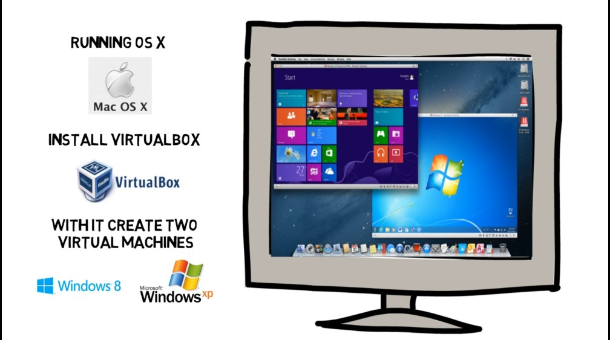

## Day 11 – Introduction to Virtual Machines (VMs)

**What I Learned:**
- VMs are like computers inside your computer
- They allow safe environments for hacking practice
- Common tools: VirtualBox, VMware, Hyper-V
- Used in labs like TryHackMe, Hack The Box

**Resource Used:**
- YouTube: What is a Virtual Machine? by IBM Technology

**My Thoughts:**
It's like having a digital playground where I can break and fix things without fear!

**Proof of Learning:**

