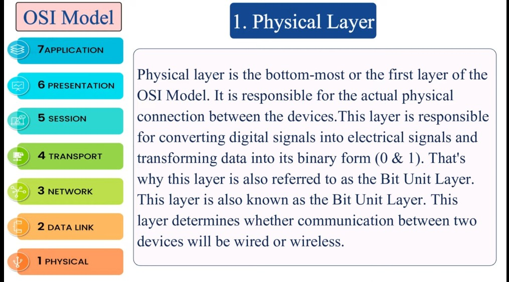

# Day 3 – Understanding the OSI Model

## What I Learned:
- OSI Model has 7 layers:
  1. Application  
  2. Presentation  
  3. Session  
  4. Transport  
  5. Network  
  6. Data Link  
  7. Physical  
- Each layer plays a unique role in how data travels over the internet.
- Mnemonic: "All People Seem To Need Data Processing"
- Helps cyber security experts know where attacks happen and how to stop them.

## Resource Used:
YouTube video: **OSI Model Explained | PowerCert**  
Link: https://www.youtube.com/watch?v=vv4y_uOneC0

## My Thoughts:
This lesson helped me understand how the internet actually works — it’s like decoding the secret steps behind every click. Super fun and mind-opening!

## Proof of Learning:

