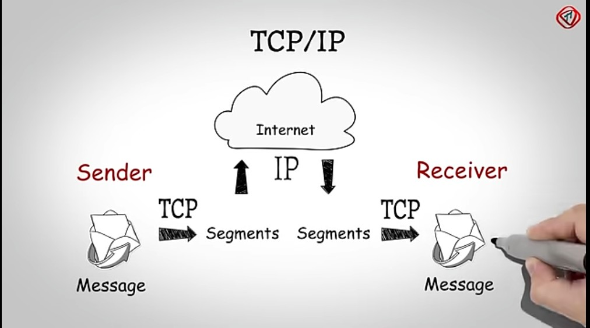

## Day 7 – TCP/IP Model & Common Ports

**What I Learned:**
- TCP/IP has 4 layers: Network Interface, Internet, Transport, Application.
- It's like the real-world version of OSI.
- Learned common port numbers used in networking.

**Comparison with OSI:**
- OSI = 7 Layers | TCP/IP = 4 Layers
- Both explain how data flows, but TCP/IP is more practical.

**Important Ports:**
- 80 (HTTP), 443 (HTTPS), 22 (SSH), 21 (FTP), 25 (SMTP), 53 (DNS)

**Resources Used:**
- YouTube: TCP/IP Model by NetworkChuck

**My Thoughts:**
Now I understand how data flows through the internet. Ports are like doors in a digital house.

**Proof of Learning:**

