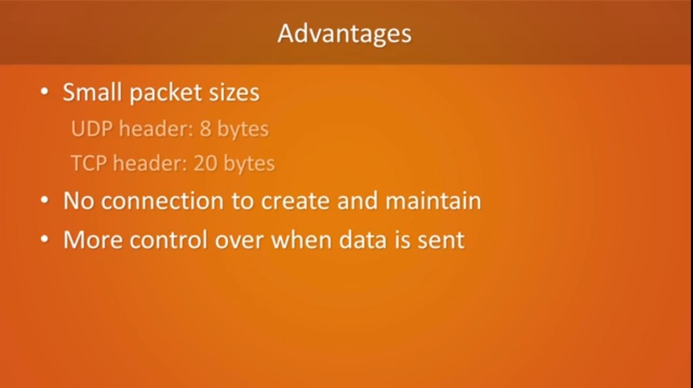

## Day 8 – Network Devices

**What I Learned:**
- Router: Connects networks, routes packets
- Switch: Smart connector in LANs
- Hub: Dumb connector, broadcasts to all
- Modem: Connects ISP to home
- Firewall: Blocks unauthorized access
- Access Point: Extends Wi-Fi range

**Comparison:**
- Router vs Switch vs Hub: Routers make smart decisions, switches work inside LANs, hubs are outdated

**Resources Used:**
- YouTube: Network Devices by PowerCert

**My Thoughts:**
Each device plays a role like soldiers in an army. A strong network depends on them working together!

**Proof of Learning:**

