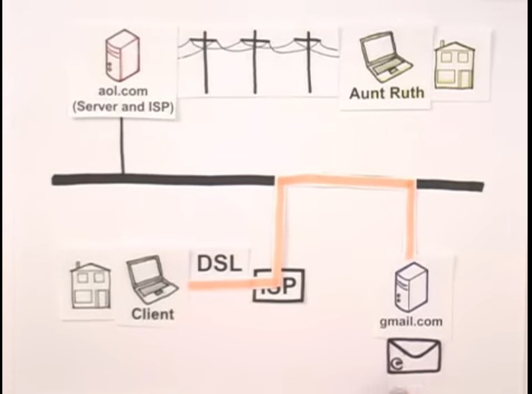

## Day 9 – How the Internet Works

**What I Learned:**
- DNS turns domain names into IP addresses
- ISP connects me to websites’ servers
- My request is broken into data packets
- HTTP/HTTPS handles how the data is sent
- It’s a client-server model: browser asks, server answers

**Resource Used:**
- YouTube: How the Internet Works by Aaron Titus

**My Thoughts:**
It feels like magic — but it’s all just brilliant engineering!

**Proof of Learning:**

